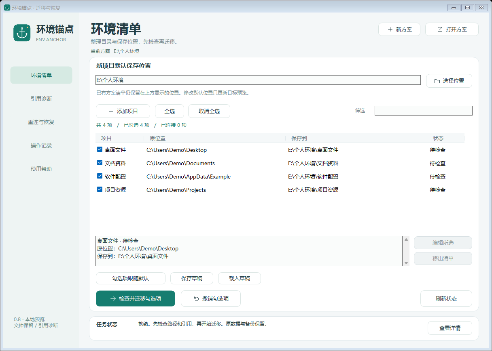
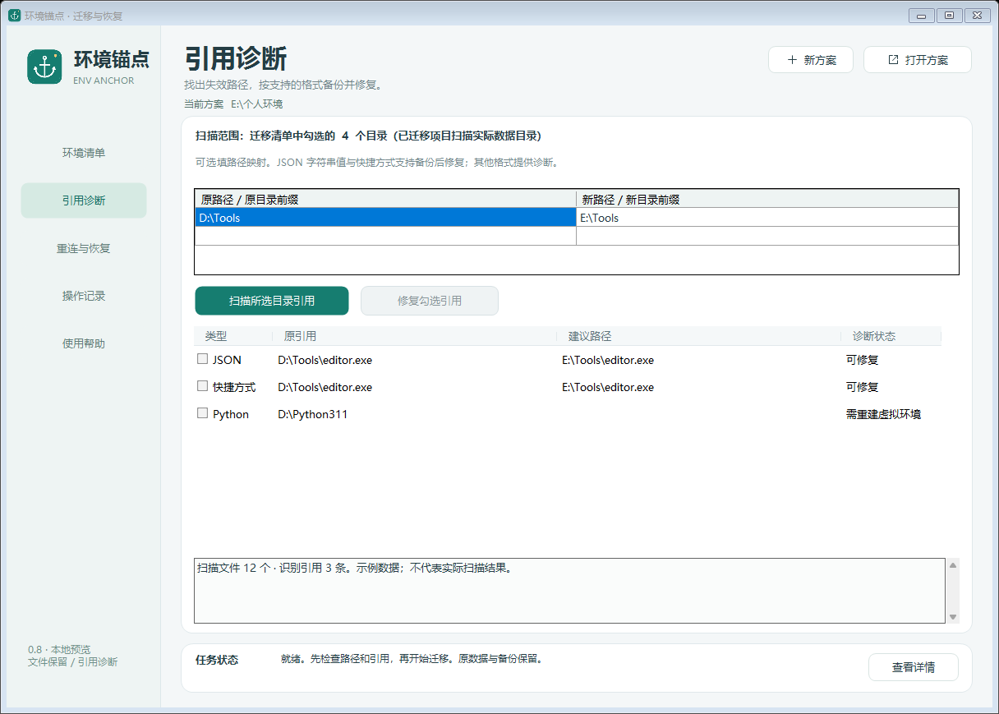

<p align="center"></p>

<h1 align="center">环境锚点 · EnvAnchor</h1>
<p align="center">整理环境，保留文件，找回引用。<br>Windows 个人目录迁移与恢复工具</p>
<p align="center"><b>0.8.0-preview.1 · 源码预览，安装包待发布</b> · 单文件客户端 · 无控制台 · 后台处理</p>

此仓库包含基于 `38fc611` 完成的 `0.8.0-preview.1` 源码、示例截图及候选构建验证记录。**0.8 预览安装包尚未上传到 GitHub Release**；以下新增功能介绍对应 0.8 源码，不代表 0.6.0 稳定版的功能。

公开稳定版仍为 [0.6.0](https://github.com/NOXEVYR/env-anchor/releases/tag/v0.6.0)：[下载便携 ZIP](https://github.com/NOXEVYR/env-anchor/releases/download/v0.6.0/EnvAnchor-0.6.0-win10-portable.zip) · [下载单文件 EXE](https://github.com/NOXEVYR/env-anchor/releases/download/v0.6.0/EnvAnchor-0.6.0.exe)。如已取得 0.8 本地候选，可双击 `EnvAnchor-0.8.0-preview.1.exe`，或解压同版本便携 ZIP 后运行 `EnvAnchor.exe`。

0.8 的候选验证 JSON、CHANGELOG、实现说明和包内使用说明保留构建时的“本地、未发布”状态记录。本页说明当前公开状态；包内历史界面文档的离线链接缺失时，可查看仓库中的 [UI-REDESIGN.md](docs/UI-REDESIGN.md)。



[引用诊断](docs/preview-references.png) · [重装后导入](docs/preview-recovery.png) · [紧凑窗口](docs/preview-compact.png) · [实现及验证说明](docs/IMPLEMENTATION-0.8.md)

## 这版解决什么

| 场景 | 处理方式 | 使用边界 |
| --- | --- | --- |
| 同机换盘、目录换位置 | 复制和逐文件 SHA-256 校验，保留原目录备份，在原位置建立 NTFS 目录联接 | 旧路径继续可用；不自动删除旧副本释放空间 |
| 系统重置，用户 SID 未改变 | 打开原方案，预检后重新连接原位置 | 持久数据、方案磁盘必须在线 |
| 重装、换账户或换机后恢复 | 提前导出恢复清单，将数据带到新系统，映射用户目录和盘符，创建新方案后重连 | 清单不含文件；需要用户自行复制数据和重新安装所需软件 |
| 配置引用仍指向旧路径 | 在选定目录扫描，按旧路径→新路径映射诊断，备份后修复支持的格式 | 自动修复 JSON 字符串值、快捷方式目标及工作目录；其他格式只诊断 |

方案文件仍默认限定原 Windows 用户 SID。跨身份恢复通过显式导入创建当前用户的新方案，不改写旧方案的身份，也不立即移动或连接目录。

## 同机迁移

1. 退出使用这些目录的软件。在“环境清单”选择非系统盘固定 NTFS 卷中的独立保存目录；不要选择磁盘根目录、工具目录、整个用户目录或整个 AppData。
2. 添加具体文件夹，编辑项目名称及单独保存位置，或让勾选项目跟随默认目录。支持筛选、全选、移除未迁移项目以及保存/载入草稿。筛选隐藏的勾选项仍在执行范围中。
3. 点击“检查并迁移勾选项”。预检展示完整范围、复制量、空间与路径冲突、连接状态以及阻塞原因；此时不写入方案或移动文件。
4. 核对预检结果再确认执行。执行时再次校验，复制后比较文件内容和空目录，保存原目录备份，再建立连接。原有副本和历史备份均保留。
5. 迁移结束后查看状态并实际启动相关软件验证。已经迁移的项目可编辑目标后再次预检迁移；旧数据副本保留，方案清单仍在原方案位置。

复制未完成、磁盘离线、文件占用或权限不足时，操作会停止并记录原因。不要手工删除备份、暂存目录或编辑 `state.json`。撤销会复制最新数据回原位置，并保留目标副本；重试时若原位置出现新内容，会另外保留冲突备份。

## 引用诊断与修复

1. 在环境清单勾选扫描目录；已迁移项目扫描实际数据目录。
2. 打开“引用诊断”，填写旧路径与新路径，例如 `D:\Tools` → `E:\Tools`。可同时填写多个映射，匹配最长的完整目录前缀。
3. 扫描后查看原引用、建议路径和诊断状态。扫描有大小、深度和数量限制，不跟随链接，不执行配置或程序，跳过常见敏感文件名及敏感 JSON 字段。
4. 只勾选可修复项目。修复前重新检查扫描结果、文件摘要和新目标，创建备份，再替换配置文件。完成后旧报告失效，需要重新扫描。

自动修复覆盖 JSON 字符串值和 `.lnk` 的目标/工作目录，不改写 JSON 键、快捷方式参数或任意脚本正文。INI、YAML、TOML、XML、脚本等文本中识别到的路径仅供诊断。Python 虚拟环境提示重建；未识别的应用数据库和二进制配置可能仍含旧路径。



## 重置与重装恢复

**同一用户的重置恢复：**打开包含 `state.json` 的原方案目录，在“重连与恢复”点击检查重连。原位置出现的普通目录先保留为备份；目标不可用时不会先移除旧连接。

**重装或换机：**在旧系统完成所有迁移后导出恢复清单，同时保留方案和实际数据。新系统中打开“重装后导入”，选择清单及独立的新方案目录，填写旧用户目录→新用户目录、旧数据盘目录→新数据目录等映射。先检查导入，确认后创建新方案，再预检并重新连接。原清单和原方案不变。

恢复清单只记录位置和文件数量/大小摘要，**不包含数据，也不是密码学内容校验或备份**。导入会核对数据目录摘要和路径条件，后续仍需实际启动软件验证。跨身份加密凭据、许可证、驱动、服务、注册表和 PATH 不会被自动迁移；安装型软件通常需要重新安装。

“保存登录设置”独立管理当前方案的自动重连入口。入口一次关联一个方案；使用系统还原软件时，还需将该入口保存到还原基线。登录重连与其他软件自启动没有顺序保证。

## 数据保护与限制

- 迁移和修改配置需用户确认；启用登录重连后会自动运行。打开界面和预检不会迁移数据。
- 迁移前退出相关软件；本工具不获取跨进程文件快照，校验期间持续写入会导致失败。
- 方案状态经过结构、路径和阶段校验；同一方案的并发写入有互斥保护。尚未完成的复制不能被当成完整数据直接挂接。
- 拒绝根目录、危险系统范围、嵌套链接、云占位文件以及项目路径重叠。磁盘离线和权限问题显示具体原因。
- 备份不会自动删除，迁移时原盘空间不会立即释放。大目录会经历复制和校验，耗时取决于磁盘与文件数量。
- 保存桌面文件不等于保存图标排列、任务栏或所有 Windows 设置；软件、身份、驱动和应用内部状态有各自要求。
- 已完成合成目录和实际窗体的离屏验证，尚未进行真实关机还原、物理跨盘、多显示器高 DPI 或用户软件验收。EXE 未签名。

## 开发与验证

构建使用 Windows 自带 .NET Framework C# 编译器、Windows PowerShell 5.1，以及已有 Python/Pillow。运行 EXE 不需要 Python 或 PowerShell 7。

```powershell
python build.py
powershell.exe -NoProfile -ExecutionPolicy Bypass -File tests\Core.Tests.ps1
powershell.exe -NoProfile -ExecutionPolicy Bypass -File tests\Preflight.Tests.ps1
powershell.exe -NoProfile -ExecutionPolicy Bypass -File tests\Environment.Tests.ps1
powershell.exe -NoProfile -STA -ExecutionPolicy Bypass -File EnvAnchor.ps1 -SmokeTest
```

`build.py` 编译嵌入全部引擎的单文件客户端，生成界面预览，再对最终 ZIP 解压出的 EXE 运行 `--self-test` 和 `--smoke-test`，核对 PE GUI 子系统、ZIP CRC、单根目录、文件清单、逐字节一致性及 SHA-256。测试只使用临时合成目录和隔离启动项。

精确测试计数、源文件摘要及产物摘要见 `releases/verification-0.8.0-preview.1.json`；改动历史见 [CHANGELOG.md](CHANGELOG.md)。旧版 0.7 的界面记录保留于 [UI-REDESIGN.md](docs/UI-REDESIGN.md)。
